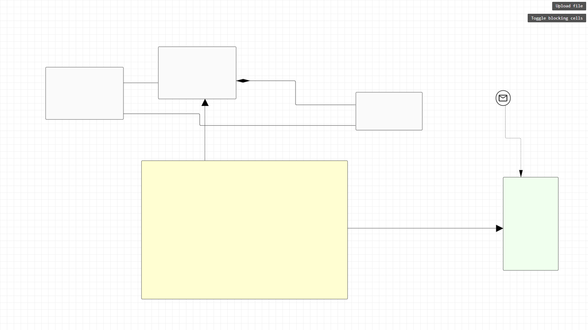
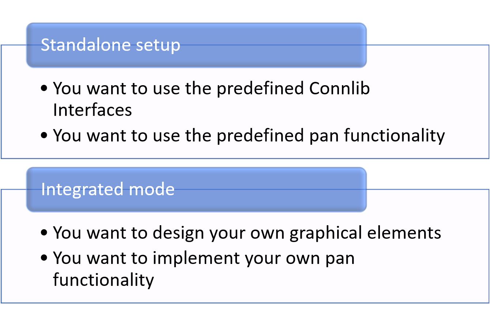
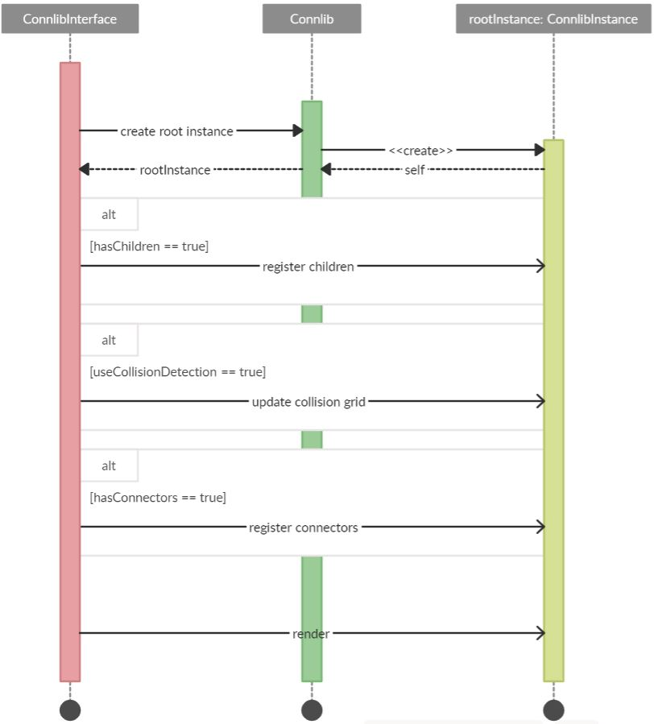

# Connlib
The repository contains Connlib, a repository for rendering connectors and modeling environments on the web. The library provides the following features:
- auto path calculation using automated shape-connector overlap detection
- add custom model constructs (relations and shapes) by inheriting predefined shapes

In the future, we plan to implement the following features:
- display intersections between connectors
- cross browser support (currently we work with Google Chrome exclusively)
- bugfixes, especially for drag around the corner

A demo is available under https://sebleich.github.io/react-connlib/ (please use with Google Chrome)

## getting started with Connlib

Initially, you need to decide whether you want to setup Connlib in standalone mode and use the predefined interfaces and functionalities or as an integrated library. 
If you are not sure which setup is the best solution for your use-case, follow the instruction below. 

However, you need to start by listening on the DOMContentLoaded event by adding `document.addEventListener("DOMContentLoaded", callbackFunction)`.

### Connlib as a standalone application

In that case, your `callbackFunction()` must call the function `Connlib.setUpStandalone()`. 
Thereby, Connlib is proceeding with the following tasks:
- using integrated pan functionality (+ setting the listeners)
- enabling the integrated model element rendering
- calling the standalone setup observable

Before your code calls the `Connlib.setUpStandalone()` method, you need to listen to the `Connlib.standaloneSetupObservable` by adding the following command:

`Connlib.standaloneSetupObservable.subscribe(onSettedUpHandle)`

After Connlib is initialized, the `standaloneSetupObservable` is fired and your `onSettedUpHandle` is called. 

### Connlib as integrated library

Connlib provides connection-shape overlap prevention. 
Therefore, we implemented an IDA* algorithm. 
The recommended flow is represented within the activity diagram below. 
Initially, a new Connlib instance should be initialized by calling `Connlib.createRootInstance()`. 
By default, Connlib searches for a root element (a div HTML element) with the identifer `id = 'root'`. 
Developers can change the root container by overwriting the public property `rootContainer` at the static `Connlib` object. 
Therefore, we recommend to use the JavaScript call `Connlib.rootContainer = document.getElementById('fooContainer')`. 
Afterward, the Connlib root instance can be accessed by calling `Connlib.rootInstance`. 
Finally, all created Connlib instances should be rendered by calling the instance's method `instance.render()`. 
Alternatively, the static method `Connlib.render()` renders all Connlib instances. 

## the static Connlib object

### properties

| Property | TS type | Description |
| --- | --- | --- |
| connectorColor | string | the connector's and arrow colors - this property is used by all default interfaces for styling |
| connlibGridScale | number | the internal collision grid's scale |
| disableConnectorDrag | boolean | is the connector drag functionality disabled? |
| endpointIndent | number | model element endpoint's indent |
| endpointPadding | number | the endpoint's padding |
| instancePadding | number | the created Connlib instance's SVG padding |
| invertMoveDirection | boolean | if the integrated pan functionality is activated: is the moving direction inverted? |
| lineOverlayWidth | number | width of the line overlay drag handles |
| moveStep | number | if the integrated pan functionality is activated: how many pixels should the viewpoint move on arrow key press? |
| moveX | number | the current viewpoint's x-transform value |
| moveY | number | the current viewpoint's y-transform value |
| rootContainer | HTMLElement | the root html element |
| rootInstance | ConnlibInstance | the Connlib root instance, available after initalization `Connlib.createRootInstance()` |
| standaloneSetup | boolean | is Connlib running in the standalone mode? |
| useConnlibPanAndKeyup | boolean | should Connlib use it's own pan and keyup navigation? |
| zoom | number | the current viewpoint's zoom level |

### methods

| Method | Parameters | Return type | Description |
| --- | --- | --- | --- |
| applyTransform | | | the method applies the current viewpoint's transform (moveX, moveY, zoom) |
| clear | | | the method clears all rendered connlib instances |
| createRootInstance | | | the method creates a new connlib root instance |
| getEndpointConnectionPoint | endpoint: ConnlibEndpoint | ConnlibEndpoint | the method returns an endpoint's connection point |
| getTypeMapEntry | namespace: string | ConnlibTypeMapEntry | the method returns a ConnlibTypeMapEntry by namespace | 
| getInstanceByGuid | guid: string | ConnlibInstance | the method returns an Connlib instance by guid |
| registerType | namespace: string, entry: ConnlibTypeMapEntry | | the method registers a ConnlibTypeMapEntry |
| renderControlBar | | | the method renders the control bar containing the options as presented in the demo version |
| repaintEverything | | | the method repaints all Connlib instances |
| roundToScale | point: ConnlibPoint | ConnlibPoint | the method rounds a given ConnlibPoint following the predefined scale and returns a new point with the rounded coordinates |
| roundValueToScale | value: number | number | the method rounds a passed point following the predefined scale and returns the rounded value |
| setUpWindowListeners | | | the method adds the window listeners for the pan & arrow key navigation (if `useConnlibPanAndKeyup == true`) and the connector drag functionality |
| startCompletePathCalculation | connector: ConnlibConnection | | the method calculates the path of the passed connector and updates the connector's path points |

### observables

The observables, implemented with rxjs. 
Thus, you can subscribe the observables by calling `subscription: Subscription = {observable}.subscribe(callback)`. 
If you want to unsubscribe, you need to call `subscription.unsubscribe()`.

| Observable | Description |
| --- | --- |
| scaleChangeObservable | is fired, when the grid-scale changes |
| standaloneSetupObservable | is fired, when Connlib is initialized in standalone mode |
| viewPointChangeObservable | is fired, when the current viewpoint position changes |
| zoomChangeObservable | is fired, when the zoom level changes |

## the Connlib instance class

A Connlib instance can be understood as a kind of container that embeds a set of elements on the same abstraction level. Exemplary, all tasks and gateways within the same BPMN line would be modeled within one Connlib instance.

### properties

| Property | TS type | Description |
| --- | --- | --- |
| componentRef | ConnlibInstanceComponent (React.Component) | the instance's react component used for rendering |
| container | HTMLElement | the instance's root HTML container |
| deepth | number | how often is the instance embedded within superordinated instances? |
| guid | string | the instance's identifier |
| internalGrid | ConnlibGrid | the instance's internal grid wrapping all cells (x: width / scale, y: height / scale) |
| layer | ConnlibLayerData | the instance's layer wrapping the position and size |
| rendered | boolean | is the instance currently rendered? this property is setted by the clear/render functionality of the instance |
| zoom | number | the instance's specific zoom level (unused yet) |

### methods

| Method | Parameters | Return type | Description |
| --- | --- | --- | --- |
| containsElement | elementId: number | boolean | returns whether the Connlib instance contains the element with the passed foreign identifier |
| registerConnector | connector: ConnlibConnection | | the method registers a new connector |
| registerElement | element: HTMLElement, elementId: number | | registers a html element at the Connlib instance |
| registerEndpoint | point: ConnlibEndpoint | | the method registers a new endpoint |
| registerLine | line: ConnlibLine | | the method registers a new line at the current instance with the passed identifier |
| remove | | | the method removes the current instance and the DOM representation |
| removeEndpoint | endpoint: ConnlibEndpoint | boolean | the method removes an endpoint from the instance |
| removeLine | line: ConnlibLine | boolean | the method removes a line from the Connlib instance |
| render | | | the method renders the current instance |
| setContainer | element: HTMLElement | | the method sets the Connlib instance's root container |
| toggleBlockedCells | | | the method hides all rendered elements and shows the blocked cells |
| updateGrid | | | the method updates the internal grid and sets the blocking state for all cells |

### observables

| Observable | Description |
| --- | --- |
| deepthChangeObservable | is fired, when the instance's deepth changes |
| gridChangeObservable | is fired, when the instance's internal grid changes |
| renderedObservable | is fired, when the instance's is rendered or removed |

## predefined model elements

Within the following section, we present the predefined elements your classes can inherit from.

| Name | Description | Customizable attributes |
| --- | --- | --- |
| ConnlibAbstractStructuralType | an abstract model element (such as a class or a scene), that is registered as a cell blocking element (Connlib recognizes such elements for collision detection) and visualized by default as a rectangular shape |<ul><li>backgroundColor: string?</li><li>borderRadius: string?</li><li>borderWidth: string?</li></ul>|
| ConnlibConnection | a default connection with a source and target endpoint style and a line style | <ul><li>lineStyle: ConnlibLineStyle</li><li>sourceEndpointType: ConnlibEndpointInterface</li><li>targetEndpointType: ConnlibEndpointInterface</li></ul> |
| ConnlibEndpointInterface | an endpoint type | <ul><li>fill?: string</li><li>portType?: ConnlibPortTypeOptions</li><li>arrowType?: ConnlibArrowTypeOptions;</li></ul> |
| ConnlibEvent | a default event as known from BPMN visualized by a circle with an icon (material design icon) | <ul><li>icon: JSX.Element</li><li>borderWidth: number</li></ul> |
