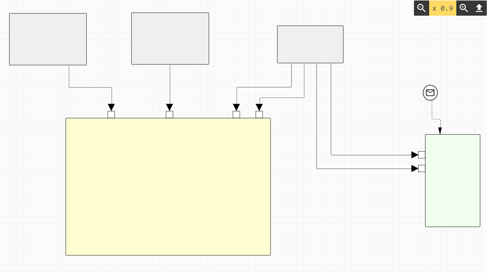

# Connlib
The repository contains Connlib, a repository for rendering connectors in the web. The library provides the following features:
- auto path calculation using automated shape-connector overlap detection
- add custom model constructs (relations and shapes) by inheriting predefined shapes

In future, we plan to implement the following features:
- display intersections between connectors

A demo is available under: https://sebleich.github.io/react-connlib/ (please use with Google Chrome)

## using Connlib with a custom framework

Connlib provides connection-shape overlap prevention. 
Therefore, we implemented an IDA* algorithm. 
